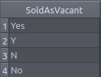

<div>
  
# Giving the Nashville Housing dataset a tidy shape

</div>

<div>

## Introduction
In this project, it will be performed a data cleaning using PostgreSQL. The target data is the famous Nashville Housing data, from [Kaggle](https://www.kaggle.com/tmthyjames/nashville-housing-data).
We are working on a Real State Company, and we received a dataset that contains information about the housing market from the Nashville city, capital of Tennessee State, United States. Our mission is to explore
this dataset and perform data normalization in it, i.e, check if the data is consistent and make the necessary transformations, so it gets the proper shape in order to be used in later Machine Learning prediction model.

#### Summary of the results

At the end of the data cleaning, we ended with a tidy dataset that have different data types, such as numeric integers and floats, strings, dates and categorical data. Therefore, this dataset can
now be used to create a Machine Learning model to predict what is the best combination of information that can lead to the best-selling price of a property.

## The data
In this dataset one can find housing information such as

1. Type of use;
2. The property address;
3. Sale date and sale price;
4. Owner name;
5. Building value and total value;
6. Year built;
7. Number of bathrooms, full bathrooms and half bathrooms.
8. Acreage.

## Cleaning the messy dataset

After a quick look we saw some transformations that are necessary to be made to the dataset:

1. Standardize the date format;
2. Fill in the NULL (missing) values in the Property Address column;
3. Separate the Property Address and the Owner Address into two columns each;
4. Change the "Y" and "N" to "Yes" and "No" in the Sold as Vacant column;
5. Remove duplicates;
6. Delete unused column;

</div>

<div>

#### 1. Standardizing the date format

This dataset contains a column called "SaleDate" that informs the date that the property was sold. Originally it has the following format:

<p align="center">


This format is appropriated for human reading, although it is not well fit to data analysis. In PostgreSQL is pretty simple to Standardize this column, we only need to use the Date() function:

```
UPDATE "NashvilleDataCleaning".housing
SET "SaleDate" = date("SaleDate")
```

And the result is:

<p align="center">


</div>

This date format can be easily read by programming languages, such as Python and R, as well as BI tools, such as Tableau and Power BI.


<div>

#### 2. Fill in the NULL values in the Property Address column

One important feature of this dataset is the PropertyAddress column. But it has 29 missing values. We could exclude those lines that have missing values, but let's try to fill in those records.

Taking an in-depth look at some rows, we find an interesting pattern:

<p align="center">


Whenever the "ParcelID" value is duplicated, so is the PropertyAddress value. This happens throughout the entire dataset. So the strategy to fill in the missing values in the PropertyAddress column is to find a different row that has the same ParcelID and has a valid PropertyAddress.<br>

We can make use of a <i>self join</i> to find out some rows that matches this condition:
```
SELECT a."ParcelID", a."PropertyAddress", b."ParcelID", b."PropertyAddress"
FROM "NashvilleDataCleaning".housing AS a
JOIN "NashvilleDataCleaning".housing AS b
    ON a."ParcelID" = b."ParcelID" and a."UniqueID" != b."UniqueID" -- The lines must be different!
WHERE a."PropertyAddress" IS NULL;
```

This self join returns the following sample table

<p align="center">


For every row with missing PropertyAddress there is a row with non-missing PropertyAddress. So, let's fill in those rows.

```
UPDATE "NashvilleDataCleaning".housing AS a
    SET "PropertyAddress" = (
        SELECT "PropertyAddress"
        FROM "NashvilleDataCleaning".housing AS b
        WHERE a."ParcelID" = b."ParcelID" AND "PropertyAddress" IS NOT NULL
          limit 1
    )
WHERE "PropertyAddress" IS NULL;
```

And if we rerun the above query that returns the NULL values it is returned:

<i>Number of records: 0</i>

</div>

<div>

#### 3. Separate the Property Address and the Owner Address

The PropertyAddress column still has a minor issue to be solved: The address is a single string in one field.

<p align="center">


This probably fine when just gathering the data, but if we want to do a deeper analysis on this data it would be better to have it separated in different columns. To achieve this, we can simply use the <i>split_part()</i> function:

```
select "PropertyAddress",
        split_part("PropertyAddress", ',', 1) as "PropertyStreetAddress",
        split_part("PropertyAddress", ',', 2) as "PropertyCityAddress"
from "NashvilleDataCleaning".housing;
```

Before updating the original table it is necessary to add two more columns: 

```
alter table "NashvilleDataCleaning".housing
add column "PropertyStreetAddress" VARCHAR(50);

alter table "NashvilleDataCleaning".housing
add column "PropertyCityAddress" VARCHAR(50);

Now I insert the values using the split_part() function.
update "NashvilleDataCleaning".housing
set "PropertyStreetAddress" = split_part("PropertyAddress", ',', 1);

update "NashvilleDataCleaning".housing
set "PropertyCityAddress" = split_part("PropertyAddress", ',', 2);
```

<p align="center">


The same thing occurs to the OwnerAddress column:

For the Street name:
```
alter table "NashvilleDataCleaning".housing
add column "OwnerStreetAddress" varchar(100);   -- Trying to use a adequate character length.

update "NashvilleDataCleaning".housing
set "OwnerStreetAddress" = split_part("OwnerAddress", ',', 1);
```
For the city name:

```
alter table "NashvilleDataCleaning".housing
add column "OwnerCityAddress" varchar(20);

update "NashvilleDataCleaning".housing
set "OwnerCityAddress" = split_part("OwnerAddress", ',', 2);
```
For the State name:
```

alter table "NashvilleDataCleaning".housing
add column "OwnerStateAddress" varchar(5);

update "NashvilleDataCleaning".housing
set "OwnerStateAddress" = split_part("OwnerAddress", ',', 3);
```
</div>

<div>

#### 4. Change the "Y" and "N" to "Yes" and "No" in the Sold as Vacant column

In these columns there are 4 different values: Yes, No, Y, N.

```
SELECT DISTINCT "SoldAsVacant"
FROM "NashvilleDataCleaning"."housing";
```

<p align="center">



Let's normalize all those values to only Yes and No:

```
SELECT REPLACE("SoldAsVacant", 'Y', 'Yes')
FROM "NashvilleDataCleaning"."housing";

-- It went wrong! Because the word "Yes" contains the "y" letter, the old "Yes" becomes "Yeses"!
-- To prevent that it is necessery to use the WHERE clause:

SELECT REPLACE("SoldAsVacant", 'Y', 'Yes')
FROM "NashvilleDataCleaning"."housing"
WHERE "SoldAsVacant" = 'Y';
-- Now it works! Now lets update it.

UPDATE "NashvilleDataCleaning"."housing"
SET "SoldAsVacant" = REPLACE("SoldAsVacant", 'Y', 'Yes')
WHERE "SoldAsVacant" = 'Y';

-- And the same for the No:
UPDATE "NashvilleDataCleaning"."housing"
SET "SoldAsVacant" = REPLACE("SoldAsVacant", 'N', 'No')
WHERE "SoldAsVacant" = 'N';
```

</div>

<div>

#### 5. Removing Duplicates

Now, that part is a tricky one. <br>
To see how many rows have duplicates we can use a group by, but first lets create a View without the "UniqueID" column, so we can use the SELECT * 

```
DROP VIEW IF EXISTS "NashvilleDataCleaning"."NoUniqueID"

CREATE VIEW "NashvilleDataCleaning"."NoUniqueID" AS 
    SELECT "ParcelID", "LandUse", "PropertyAddress", "SaleDate", "SalePrice", "LegalReference", "SoldAsVacant",
    "OwnerName", "OwnerAddress", "Acreage", "TaxDistrict", "LandValue", "BuildingValue", "TotalValue", "YearBuilt", 
    "Bedrooms", "FullBath", "HalfBath", "PropertyStreetAddress", "PropertyCityAddress", "OwnerStreetAddress", "OwnerCityAddress", "OwnerStateAddress"
    FROM "NashvilleDataCleaning".housing;
    
```

And then the grouping, to count the occurrences of each row:

```
SELECT count("PropertyAddress") AS "Duplicates", *
FROM "NashvilleDataCleaning"."NoUniqueID"
GROUP BY "ParcelID", "LandUse", "PropertyAddress", "SaleDate", "SalePrice", "LegalReference", "SoldAsVacant",
    "OwnerName", "OwnerAddress", "Acreage", "TaxDistrict", "LandValue", "BuildingValue", "TotalValue", "YearBuilt", 
    "Bedrooms", "FullBath", "HalfBath", "PropertyStreetAddress", "PropertyCityAddress", "OwnerStreetAddress", "OwnerCityAddress", "OwnerStateAddress"
HAVING count("PropertyAddress") > 1;
```
So, there are 102 duplicates in the dataset!
There is a couple of ways of removing duplicated records of a table.
For example, we can use a row_number() with PARTITION BY to delete those rows

```
DROP VIEW IF EXISTS "NashvilleDataCleaning"."temptable";
CREATE VIEW "NashvilleDataCleaning"."temptable" AS 
SELECT *, 
    row_number() OVER (
    PARTITION BY "ParcelID", "LandUse", "PropertyAddress", "SaleDate", "SalePrice", "LegalReference", "SoldAsVacant",
    "OwnerName", "OwnerAddress", "Acreage", "TaxDistrict", "LandValue", "BuildingValue", "TotalValue", "YearBuilt", 
    "Bedrooms", "FullBath", "HalfBath", "PropertyStreetAddress", "PropertyCityAddress", "OwnerStreetAddress", "OwnerCityAddress", "OwnerStateAddress"
    ORDER BY "UniqueID") AS row_num
FROM "NashvilleDataCleaning"."housing";
```
If we select everything where row_num < 2 we have a new table without duplicates!

```
SELECT * 
FROM "NashvilleDataCleaning"."temptable"
WHERE row_num < 2;
```

Create a new VIEW
```
CREATE VIEW IF NOT EXISTS "NashvilleDataCleaning"."finaltable" as 
SELECT * 
FROM "NashvilleDataCleaning"."temptable"
WHERE row_num < 2;
```

Now we just need to transform this View in a proper table
```
CREATE TABLE "NashvilleDataCleaning".nashville AS
    SELECT * from "NashvilleDataCleaning"."finaltable";
```

</div>

<div>

#### 6. Delete unused column

We just need to run an ALTER TABLE statement
```
alter table "NashvilleDataCleaning".nashville
drop column "OwnerAddress", "PropertyAddress", "TaxDistrict", row_num;
```

### Conclusion

In this project we transformed a potential but faulty dataset into a clean and tidy table, that is ready for provide insights about the Nashville housing market. Therefore, the
Business Intelligence team can analyse this data and retrieve valuable information from the past and present and the Data Science team can build models to predict the future of the Real State
market of Nashville.

To achieve this state we performed a data cleaning and transformation using PostgreSQL. Concepts like date functions, string functions, Views and Temporary tables were used, altogether with
Update and Alter table statements.

</div>