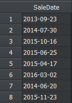
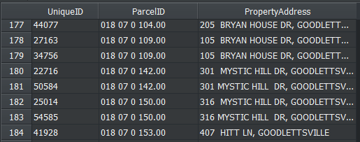
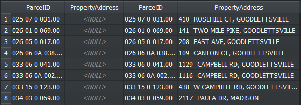
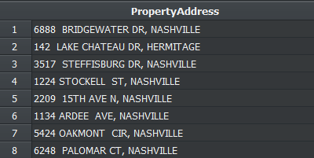
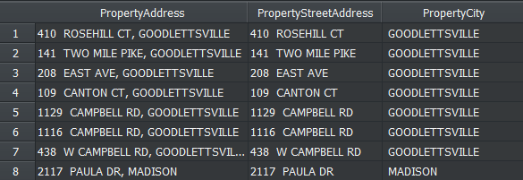

<div>
  
# Nashville Housing Data Cleaning

Hi there! In this project I will go through a data cleaning in the "Nashville Housing" dataset
 
<hr>
</div>

<div>


### Introduction

This dataset contains information about the Nashville housing market and can be found in [Kaggle](https://www.kaggle.com/tmthyjames/nashville-housing-data). <br>

#### Let's get right into it! I intend to make some data cleaning, for example

1. Standardize the date format
2. Fill in the NULL values in the Property Address column
3. Separate the Property Address and the Owner Address
4. Change the Y and N to Yes and No in the Sold as Vacant column
5. Remove duplicates
6. Delete unused column

</div>
<hr>

<div>

#### 1. Standardizing the date format

This dataset contains a column "SaleDate" that informs the date that the property were sold. Originally it is the following formating:

<p align="center">


In PostgreSQl is pretty simple to Standardize this column. We only need to use the Date() function:

```
UPDATE "NashvilleDataCleaning".housing
SET "SaleDate" = date("SaleDate")
```

And the result is:

<p align="center">


</div>


</div>

#### 2. Fill in the NULL values in the Property Address column

One important feature of this dataset is the PropertyAddress column. But it has 29 missing values. We could exclude those lines that have missing values, but let's try to fill in those records.

There is a pattern that make it make easier:

<p align="center">


Whenver the "ParcelID" value is duplicated, so is the PropertyAddress value. This happens throughout the entire dataset. So the strategy to fill in the missing values in the PropertyAddress column is to find a different row that has the same ParcelID and has a valid PropertyAddress.<br>

We can make use of a <i>self join</i> to find out some rows that matches this criteria:
```
SELECT a."ParcelID", a."PropertyAddress", b."ParcelID", b."PropertyAddress"
FROM "NashvilleDataCleaning".housing AS a
JOIN "NashvilleDataCleaning".housing AS b
    ON a."ParcelID" = b."ParcelID" and a."UniqueID" != b."UniqueID" -- The lines must be different!
WHERE a."PropertyAddress" IS NULL;
```

This self join returns the following sample table

<p align="center">


For every row with missing PropertyAddress there is a row with non-missing PropertyAddress. So, let's fill in those rows.

```
UPDATE "NashvilleDataCleaning".housing AS a
    SET "PropertyAddress" = (
        SELECT "PropertyAddress"
        FROM "NashvilleDataCleaning".housing AS b
        WHERE a."ParcelID" = b."ParcelID" AND "PropertyAddress" IS NOT NULL
          limit 1
    )
WHERE "PropertyAddress" IS NULL;
```

And if we rerun the above query that returns the NULL values it is returned:

<i>Number of records: 0</i>

</div>

<div>

#### 3. Separate the Property Address and the Owner Address

The PropertyAddress column still has a minor issue to be solved: The address a single string in one field. This probably fine when just gathering the data, but if we want to make a deeper analysis on this data it would be better to have it separated in different columns. To achieve this, we can simply use the <i>split_part()</i> function:

<p align="center">


```
select "PropertyAddress",
        split_part("PropertyAddress", ',', 1) as "PropertyStreetAddress",
        split_part("PropertyAddress", ',', 2) as "PropertyCity"
from "NashvilleDataCleaning".housing;
```

But, before updating the original table it is necessary to add two more columns: 

```
alter table "NashvilleDataCleaning".housing
add column "StreetAddress" VARCHAR(50);

alter table "NashvilleDataCleaning".housing
add column "City" VARCHAR(50);

Now I insert the values using the split_part() function.
update "NashvilleDataCleaning".housing
set "StreetAddress" = split_part("PropertyAddress", ',', 1);

update "NashvilleDataCleaning".housing
set "City" = split_part("PropertyAddress", ',', 2);
```

<p align="center">


The same thing occurs to the OwnerAddress column:

```
alter table "NashvilleDataCleaning".housing
add COLUMN "OwnerStreetAddress" varchar(100);   -- Trying to use a adequate character length.

update "NashvilleDataCleaning".housing
set "OwnerStreetAddress" = split_part("OwnerAddress", ',', 1);
```
For the city name

```
alter table "NashvilleDataCleaning".housing
add column "OwnerCityAddress" varchar(20);

update "NashvilleDataCleaning".housing
set "OwnerCityAddress" = split_part("OwnerAddress", ',', 2);
```
```
For the State name
alter table "NashvilleDataCleaning".housing
add column "OwnerStateAddress" varchar(5);

update "NashvilleDataCleaning".housing
set "OwnerStateAddress" = split_part("OwnerAddress", ',', 3);
```
</div>


<div>

#### 4. Change the Y and N to Yes and No in the Sold as Vacant column

In this columns there are 4 different values: Yes, No, Y, N. Lets normalize all those values to only Yes and No:

```
update "NashvilleDataCleaning"."housing"
set "SoldAsVacant" = REPLACE("SoldAsVacant", 'Y', 'Yes')
where "SoldAsVacant" = 'Y';

update "NashvilleDataCleaning"."housing"
set "SoldAsVacant" = REPLACE("SoldAsVacant", 'N', 'No')
where "SoldAsVacant" = 'N';
```

That was quite simple.
</div>


<div>

#### 5. Removing Duplicates

Now, that parte is a really tricky one.

</div>